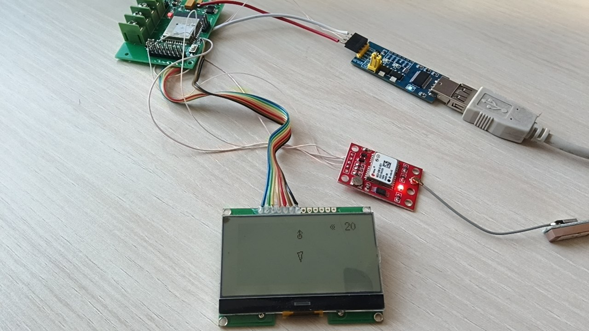
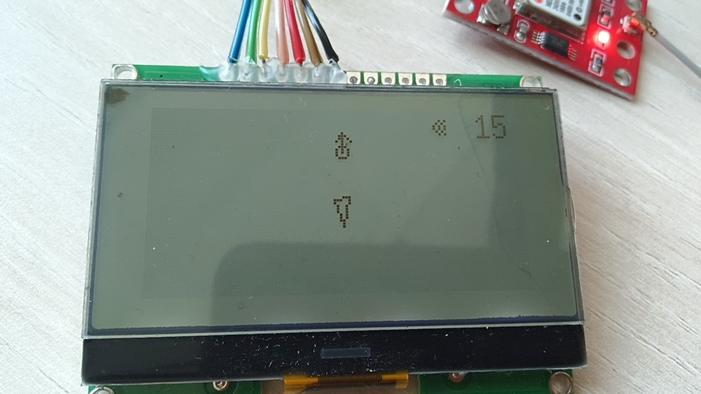
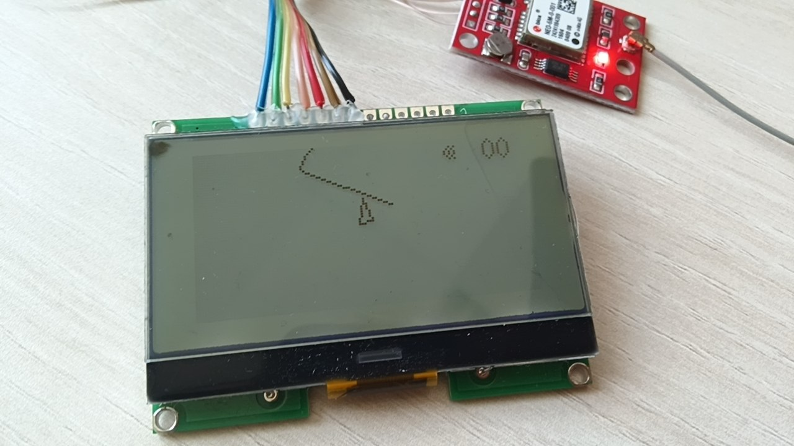
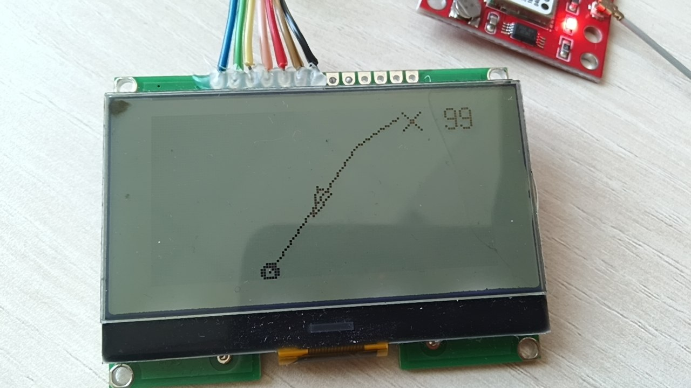
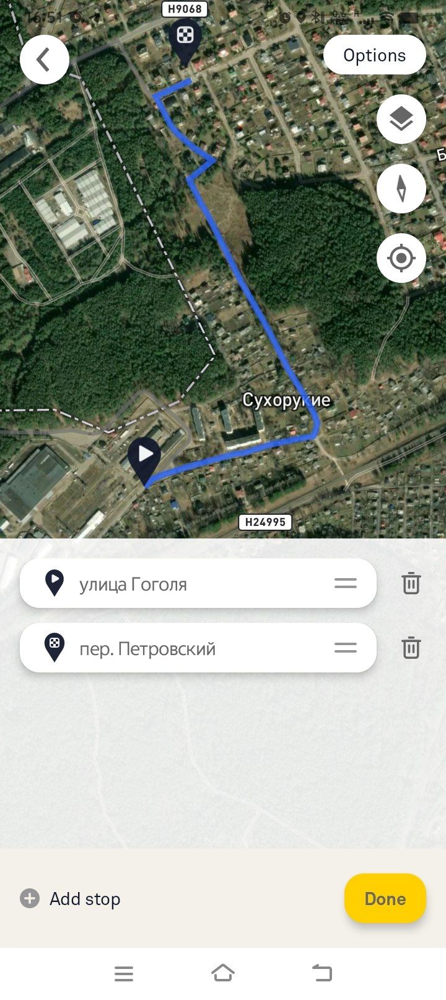

# esp32  4mb







<a href="img/video_2026-05-15_12-24-35.mp4">Видосик 1</a>
<a href="img/video_2026-05-15_12-24-56.mp4">Видосик 2</a>

Visual Studio Code

## Библиотеки
-TinyGPSPlus
-U8g2
```
В консоль гонит GPS данные
$GNVTG,,,,,,,,,N*2E
$GNGGA,091415.000,,,,,0,03,3.67,,,,,,*71
$GNRMC,091417.000,V,,,,,,,150526,,E,N,V*63
$GNVTG,,,,,,,,,N*2E
$GNGGA,091417.000,,,,,0,03,3.67,,,,,,*73

при отправке 0 - симуляция маршрута
1..99 перейдет и покажет точку на маршруте

по WIFI RockotAP с паролем 12345678  через браузер 192.168.4.1 можно загрузить маршрут

```
